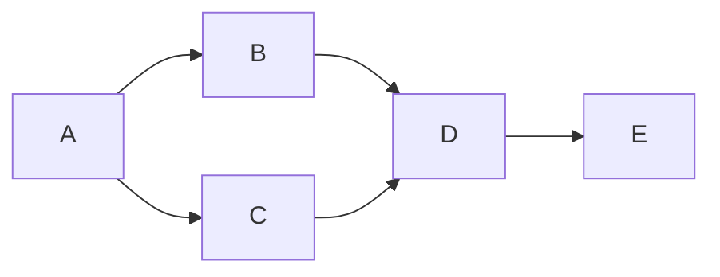
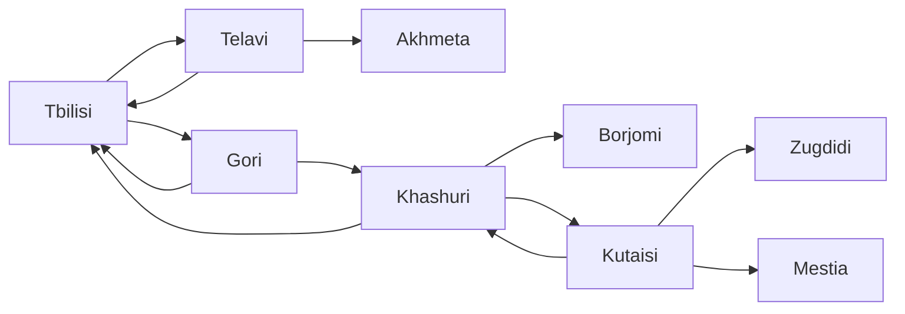

# Task 2 - Graphs

## Graph 1

```mermaid
graph LR
    A --> B
    A --> C
    B --> D
    C --> D
    D --> E
```

## Graph 2

```mermaid
graph LR
    Tbilisi --> Gori
    Tbilisi --> Telavi
    Telavi --> Akhmeta
    Telavi --> Tbilisi
    Gori --> Khashuri
    Gori --> Tbilisi
    Khashuri --> Borjomi
    Khashuri --> Kutaisi
    Khashuri --> Tbilisi
    Kutaisi --> Zugdidi
    Kutaisi --> Mestia
    Kutaisi --> Khashuri
```